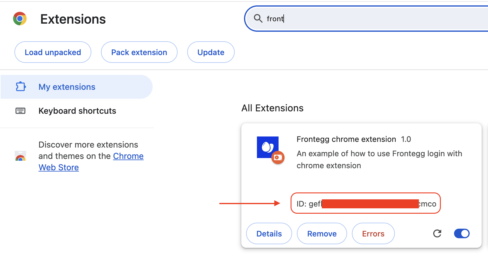

# Chrome Extension Guide
In order to integrate Frontegg login box with a chrome extension you should have two projects that the first one is your extension and the second is an app for the frontegg login box.  
This repo includes two main directories, chrome-extension-application and login-box-application, clone this repo and follow this guide. 


## Installation

First, install each project's dependencies, we will start with the extension dir
```bash
# change directory to the extension's directory
cd chrome-extension-application

# install dependencies
npm install
```
Change directory to the login-box's directory and install the dependencies
```bash
# go back to main dir 
cd ..

# change to second app dir
cd login-box-application

# install dependencies
npm install
```
#### 1. Chrome extension application changes should be made:
* ```App.tsx```:
  * Insert your account values to contextOptions and change the values of “ApplicationName” to your own application name
* ```Login.tsx```:
   * change the value of APP_URL to your own application url

#### 2. Login Box application changes should be made:
* ```index.tsx```:
    * Insert your values to contextOptions

#### 3. Upload your chrome extension to your chrome browser:
- Build your project:
```bash 
npm run build
```
- A new directory name 'dist' will be created under 'chrome-extension-application' project
- Go to ```chrome://extensions/``` and upload that 'dist' folder
#### 4. In your Frontegg portal:
go to Env settings -> Domains -> Allowed Origins then add your extension's origin as following:
   * ```chrome-extension://[Your-Extension-ID]```
     * You can find your extension id in ```chrome://extensions/``` under your uploaded extension



### Usage:
* Run chrome-extension by using ```npm run dev```
* Open your extension
* Click on the ```click me to login``` button
* A new tab with the login box will be opened, you should login with your credentials, then, after a successful login you will see a logout button and the following message:  
```You are authenticated, you can close this tab and open the extension```  
* As the message says, you can now close this login box tab and open the chrome extension, if everything worked as expected you should see the following message in your chrome extension app  
```Welcome , you are authenticated```


---
